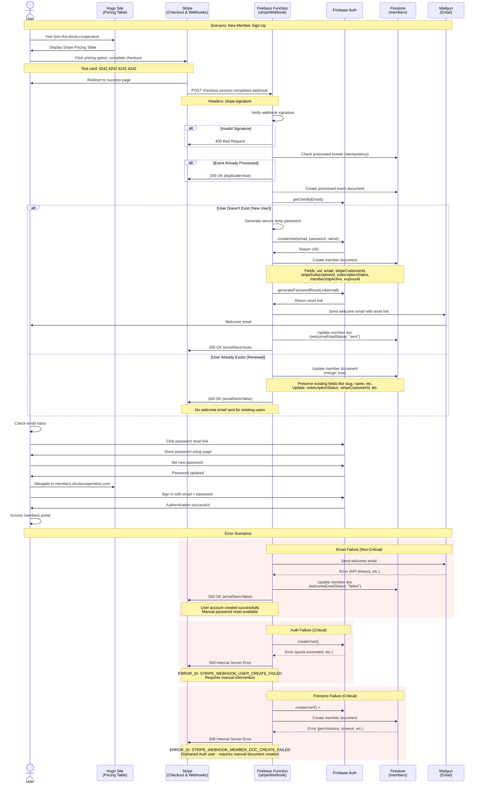

## Flow Description

### Happy Path - New User

1. **User Checkout**: User completes payment via Stripe Pricing Table on Hugo site
2. **Webhook Delivery**: Stripe sends `checkout.session.completed` event to Firebase Function
3. **Signature Verification**: Function verifies webhook signature for security
4. **Idempotency Check**: Function checks if event was already processed
5. **User Lookup**: Function checks if user exists in Firebase Auth
6. **User Creation**: For new users, generates secure temp password and creates Auth user
7. **Member Document**: Creates Firestore document with subscription details
8. **Welcome Email**: Sends email via Mailgun with password reset link
9. **Success Response**: Returns 200 OK to Stripe
10. **User Password Setup**: User clicks link in email and sets password
11. **Portal Access**: User signs in to members portal

### Happy Path - Existing User (Renewal)

1-5. Same as new user flow
6. **User Update**: For existing users, function recognizes email already exists
7. **Member Document Update**: Updates Firestore document with new subscription details (merge: true)
8. **Success Response**: Returns 200 OK to Stripe (no email sent)
9. **Existing Access**: User continues using existing credentials

### Error Scenarios

#### Email Failure (Non-Critical)
- User account created successfully
- Email fails to send (Mailgun error)
- Function still returns 200 OK to Stripe
- Member document marked with `welcomeEmailStatus: "failed"`
- User can manually request password reset

#### Auth Failure (Critical)
- User creation fails (quota exceeded, etc.)
- Function returns 500 error to Stripe
- Stripe will retry webhook (up to 3 days)
- Requires manual intervention if retries fail

#### Firestore Failure (Critical)
- User created in Auth successfully
- Member document creation fails
- Function returns 500 error to Stripe
- Creates orphaned Auth user
- Requires manual member document creation

## Key Security Features

- ✅ Webhook signature verification prevents unauthorized access
- ✅ Idempotency prevents duplicate user creation
- ✅ Temporary password never sent to user
- ✅ Password reset flow enforced via email
- ✅ HTTPS required for all Firebase Functions

## Monitoring Points

- 📊 Webhook success rate (target: >99%)
- 📊 Response time (target: p95 <2s)
- 📊 Email delivery rate (target: >95%)
- 📊 Error distribution by ERROR_ID

## Related Documentation

- [Setup Guide](../SETUP.md) - Initial configuration
- [Testing Guide](../TESTING_GUIDE.md) - Manual testing scenarios
- [Troubleshooting](../TROUBLESHOOTING.md) - Debug common issues
- [Production Monitoring](../PRODUCTION_MONITORING.md) - Observability
