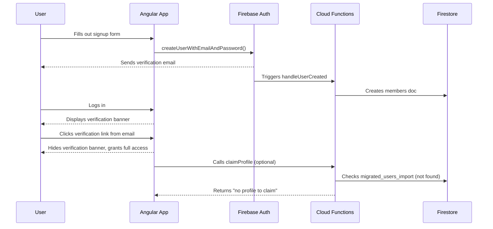
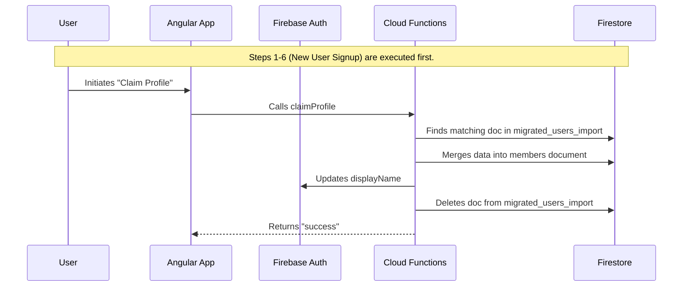

# Auth Flows

This document describes the authentication flows for the Doula Cooperative members application.

## 1. Brand New User Signup

This flow describes the process for a user who has never been a part of the Doula Cooperative before.

1.  **User Fills Out Signup Form**: The user provides their email and password in the Angular application's signup form.
2.  **Create Firebase Auth User**: The Angular app's `AuthService` calls `createUserWithEmailAndPassword`. This creates a new user account in Firebase Authentication.
3.  **Send Verification Email**: Upon successful user creation, Firebase Authentication automatically sends a verification email to the user.
4.  **User Can Log In**: The user can now log in to the application. However, until their email is verified, they will see a persistent banner prompting them to check their email. They have limited access to the application's features.
5.  **Create Member Document**: The creation of a new user in Firebase Auth triggers the `handleUserCreated` Cloud Function. This function creates a new document for the user in the `members` collection in Firestore. The document is created with the user's `uid` and `email`.
6.  **User Verifies Email**: The user clicks the verification link in their email, which directs them back to the Angular application.
7.  **Verification Banner is Removed**: Once the application recognizes the verified email status, the banner disappears, and the user gains full access.
8.  **Profile Claim (No-op)**: The user might be presented with an option to "claim a profile". When they initiate this, the `claimProfile` Cloud Function is called. For a new user, this function will not find a matching profile in the `migrated_users_import` collection, so it does nothing further.

## 2. Existing Doula Coop Subscriber Signup

This flow is for existing members who are signing up for the online application for the first time. Their profile information has been pre-migrated into the system.

1.  **Initial Signup**: The first seven steps are identical to the "Brand New User Signup" flow. A Firebase Auth user is created, a verification email is sent, the user can log in with limited access, a basic `members` document is created in Firestore, and the user verifies their email to gain full access.
2.  **Claim Profile**: After verifying their email, the user is prompted to claim their existing profile. The user initiates the claim process in the Angular app.
3.  **Invoke Claim Profile Function**: The `AuthService` calls the `claimProfile` Cloud Function.
4.  **Find Migrated Profile**: The `claimProfile` function searches the `migrated_users_import` collection in Firestore for a document with an ID matching the user's email address.
5.  **Merge Profile Data**: If a matching document is found, the data from that document is merged into the user's existing document in the `members` collection. This populates their profile with the migrated information.
6.  **Update Auth DisplayName**: The function also updates the user's `displayName` in Firebase Authentication with their name from the profile data.
7.  **Remove Import Record**: After successfully merging the data, the function deletes the document from the `migrated_users_import` collection to prevent it from being claimed again.

