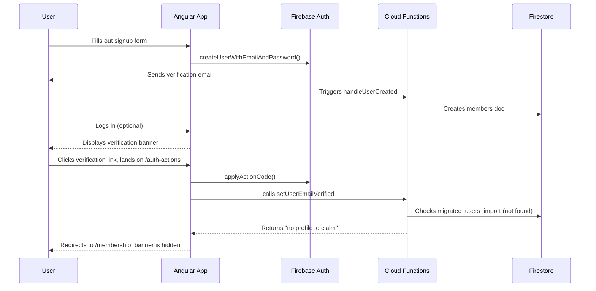
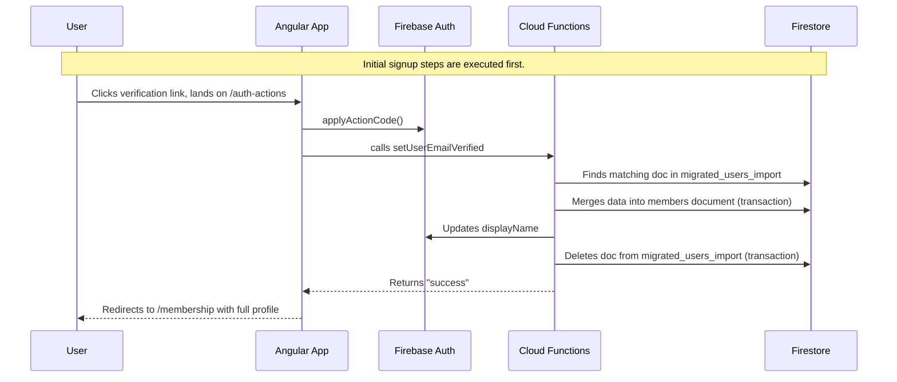

# Auth Flows

This document describes the authentication flows for the Doula Cooperative members application.

## 1. Brand New User Signup

This flow describes the process for a user who has never been a part of the Doula Cooperative before.

1.  **User Fills Out Signup Form**: The user provides their email and password in the Angular application's signup form.
2.  **Create Firebase Auth User**: The Angular app's `AuthService` calls `createUserWithEmailAndPassword`. This creates a new user account in Firebase Authentication.
3.  **Send Verification Email**: Upon successful user creation, Firebase Authentication automatically sends a verification email to the user. The link in this email points to the `/auth-actions` page of the application.
4.  **User Can Log In**: The user can now log in to the application. However, until their email is verified, they will see a persistent banner prompting them to check their email. They have limited access to the application's features.
5.  **Create Member Document**: The creation of a new user in Firebase Auth triggers the `handleUserCreated` Cloud Function. This function creates a new document for the user in the `members` collection in Firestore. The document is created with the user's `uid` and `email`.
6.  **User Verifies Email**: The user clicks the verification link in their email. This directs them to the application's `/auth-actions` page, which is designed to handle Firebase authentication actions.
7.  **Application Handles Verification**: The `AuthActions` component reads the action code from the URL, verifies it with Firebase using `applyActionCode`, and then calls the `setUserEmailVerified` Cloud Function.
8.  **Profile Claim (No-op) and Redirect**: The `setUserEmailVerified` function checks for a migrated profile. For a new user, it finds none. Upon successful completion, the `AuthActions` component redirects the user to their `/membership` page. The verification banner is no longer shown, and the user has full access.

## 2. Existing Doula Coop Subscriber Signup

This flow is for existing members who are signing up for the online application for the first time. Their profile information has been pre-migrated into the system.

1.  **Initial Signup**: The initial steps (1-5) are identical to the "Brand New User Signup" flow. A Firebase Auth user is created, a verification email is sent, a basic `members` document is created, and the user can log in with limited access.
2.  **Email Verification and Profile Claim**: The user clicks the verification link in their email, which directs them to the `/auth-actions` page. The `AuthActions` component calls `applyActionCode` to verify the email. It immediately follows up by calling the `setUserEmailVerified` Cloud Function.
3.  **Find Migrated Profile**: The `setUserEmailVerified` function searches the `migrated_users_import` collection in Firestore for a document with an ID matching the user's email address.
4.  **Merge Profile Data**: If a matching document is found, the data from that document is merged into the user's existing document in the `members` collection.
5.  **Update Auth DisplayName**: The function also updates the user's `displayName` in Firebase Authentication with their name from the profile data.
6.  **Remove Import Record**: After successfully merging the data, the function deletes the document from the `migrated_users_import` collection. These Firestore operations are performed in a single atomic transaction.
7.  **Redirect to Membership**: The `AuthActions` component redirects the user to their `/membership` page, where they can now see their fully populated profile information.

